::: column-margin
# Janusz Chmaruk

## Kontakt

-   [chmarukjanusz\@gmail.com](mailto:chmarukjanusz@gmail.com)

## Języki

-   Angielski: B2,
TOEIC test: [link](https://www.etsglobal.org/fr/en/digital-score-report/09E18694EF20509DD45581EAF697E1DC37C03ADB6F89A4BC046EC076C638BF38d1A2eEh0MVdXbTh3OStkN0JoZFRYYklaM0NBTSs3QVdlT3RRRk9EMlBFNFVMd2JN)
:::

## Edukacja

### Technik mechatronik

Ukończono Zespół Szkół Mechanicznych i Ogólnokształcących nr 5 w Łomży z tytułem: Technik mechatronik

Kwalifikacje zawodowe:

-   E3 Montaż urządzeń i systemów mechatronicznych
-   E18 Eksploatacja urządzeń i systemów mechatronicznych
-   E19 Projektowanie i programowanie urządzeń i systemów mechatronicznych,

::: {style="color: gray"}
2015-2019
:::

### Studia - Automatyka i Robotyka

Politechnika Białostocka:

-   I stopień (ukończony), specjalizacja: automatyzacja i informatyzacja procesów
-   II stopień (ostatni semestr), specjalizacja: automatyka przemysłowa

::: {style="color: gray"}
2019-2024
:::

### Koło SumoMasters{#sec-1}

Aktywny członek koła naukowego na Politechnice Białostockiej (zawody robotów w Kolumbi, Brazyli, Litwie, Rumuni):

-   strona koła naukowego: [wm.pb.edu.pl/studenci/kola-naukowe/projekty-studenckie/sumomasters](https://wm.pb.edu.pl/studenci/kola-naukowe/projekty-studenckie/sumomasters/)

::: {style="color: gray"}
2022-2024
:::

::: {.callout-important collapse=true title="Wykonane przeze mnie roboty"}

Część mechaniczna robotów (zaprojektowanie, wykonanie części na frezarce CNC i złożenie) została wykonana przeze mnie. Elektronika została wykonana przez Norberta Waśkiewicza.

::: {#fig-kumo-v3 layout="[[1,1],[1,1],[1]]"}
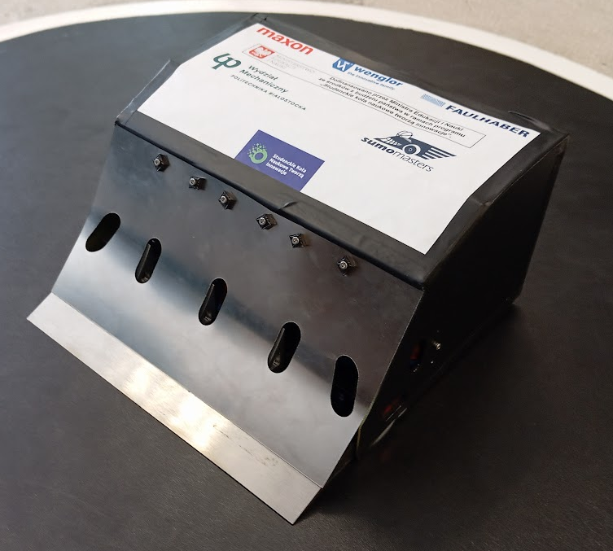{#fig-1 width="70%"}

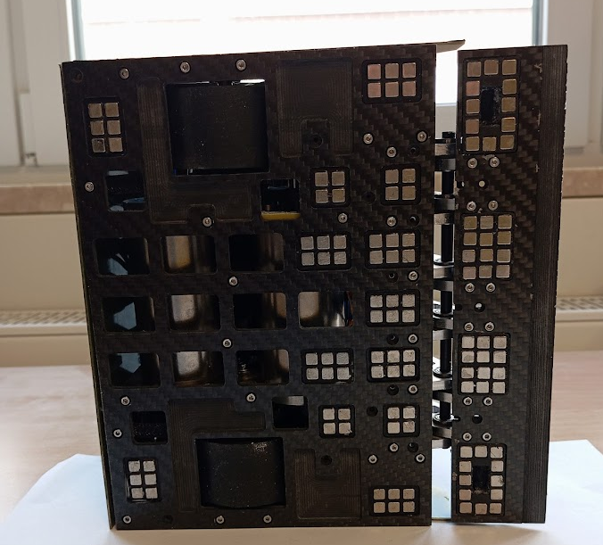{#fig-2 width="70%"}

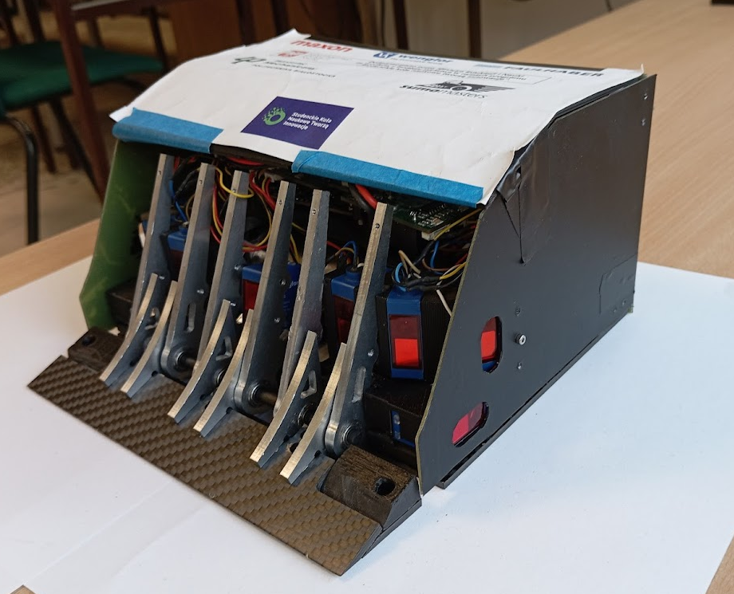{#fig-kumo-v3-bez-przedniej width="70%"}

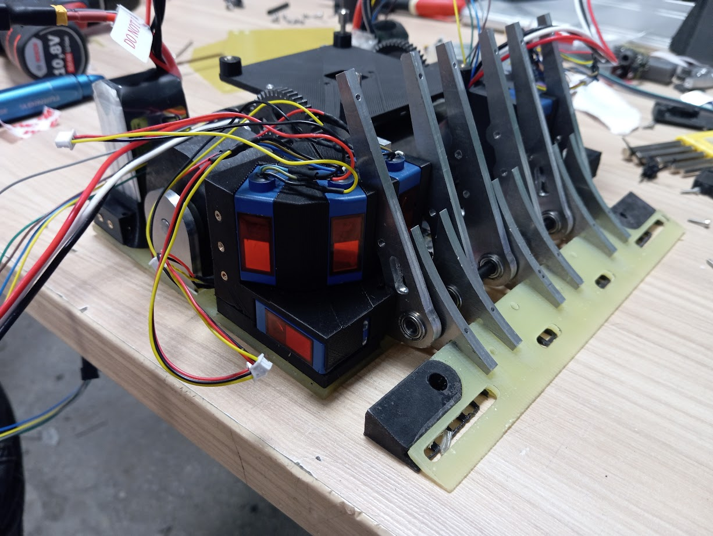{#fig-6 width="70%"}

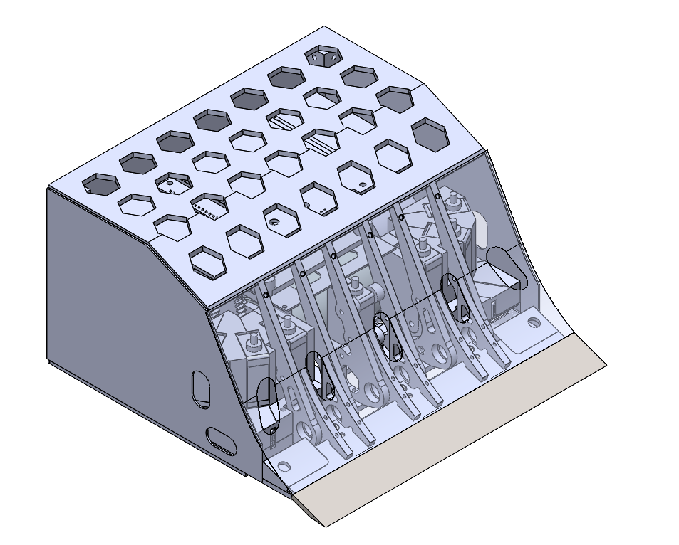

Kumo v3, oprócz wykonania fizycznego przedniej blachy sprężynówki, wszystko zostało wykonane przeze mnie
:::

::: {#fig-kumo-v2 layout="[[1,1],[1]]"}
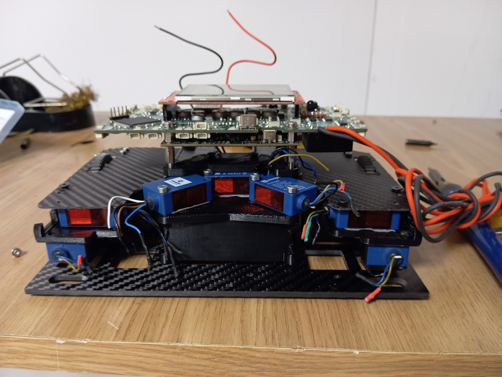{#fig-8 width="70%"}

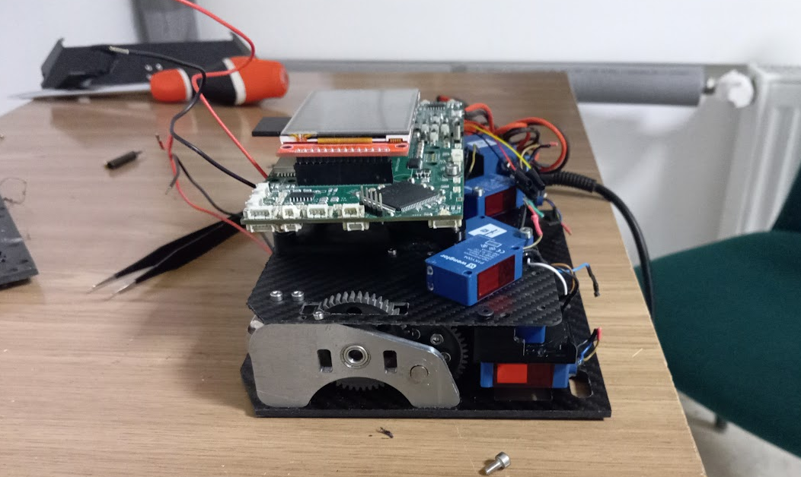{#fig-9 width="70%"}

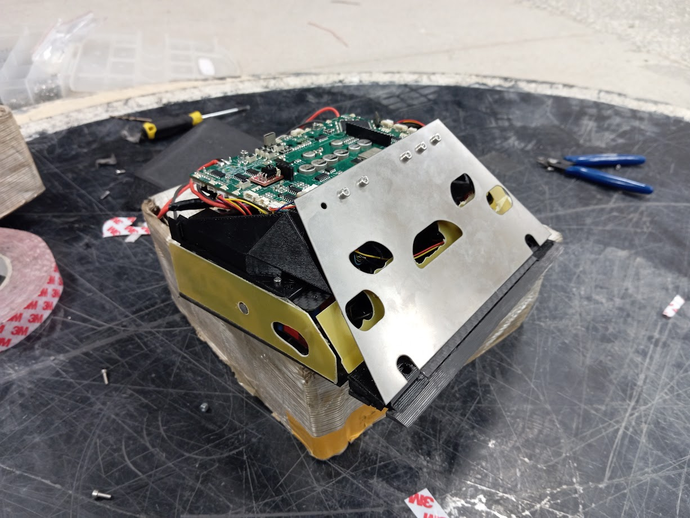{#fig-10 width="70%"}

Kumo v2
:::

::: {#fig-kumo-v1 layout="[[1,1],[1,1]]"}
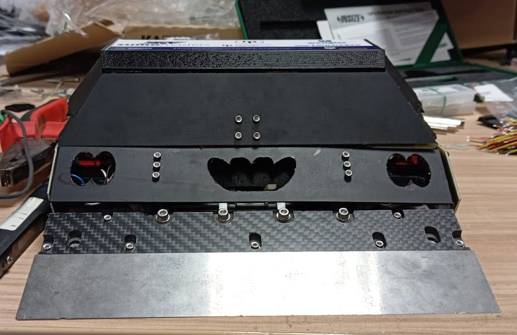{#fig-3 width="70%"}

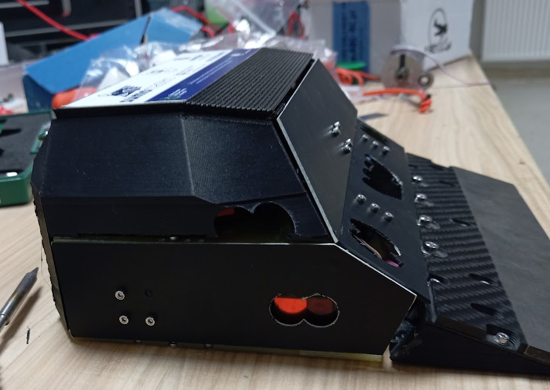{#fig-5 width="70%"}

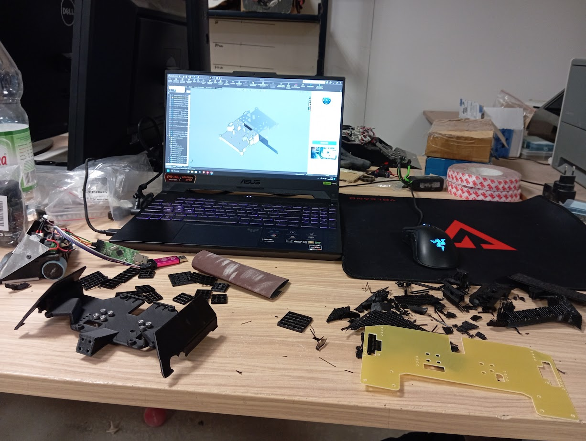{#fig-6 width="70%"}

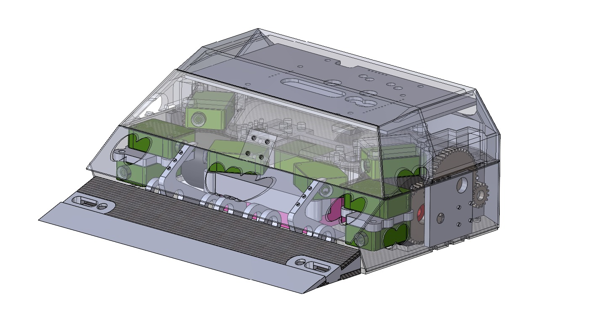{#fig-7 width="70%"}

Kumo v1
:::

:::

## Umiejętności / Uprawnienia

### Uprawnienia SEP

Spełniam wymagania kwalifikacyjne do wykonywania pracy na stanowisku EKSPLOATACJI w zakresie obsługi, konserwacji, remontu lub naprawy, montażu lub demontażu dla następujących urządzeń, instalacji i sieci:

1.  urządzenia prądotwórcze przyłączone do sieci przesyłowej lub dystrybucyjnej energii elektrycznej bez względu na wysokość napięcia znamionowego;

2.  urządzenia, instalacje i sieci elektroenergetyczne o napięciu znamionowym nie wyższym niż 1kV;

11. elektryczne urządzenia w wykonaniu przeciwwybuchowym;

13. aparatura kontrolno-pomiarowa oraz urządzenia i instalacje automatycznej regulacji, sterowania i zabezpieczeń urządzeń i instalacji wymienionych w pkt 1,2,11

::: {style="color: gray"}
Ważne do 17.04.2029
:::

### Uprawnienia na wózek widłowy UDT

Zakres uprawnienia: Wózki jezdniowe podnośnikowe z mechanicznym napędem podnoszenia z wyłączeniem wózków z wysięgnikiem oraz wózków z osobą obsługującą podnoszoną wraz z ładunkiem

::: {style="color: gray"}
 Ważne do 21.12.2033 
:::

### Aktualne orzeczenie Sanepid

Aktualne orzeczenie lekarskie do celów sanitarno-epidemiologicznych

::: {style="color: gray"}
bezterminowe
:::

### Umiejętność obsługi frezarki

KIMLA CNC 3-osiowa (starszy model)
    
::: {style="color: gray"}
2022-2024, Koło SumoMasters
:::

## Doświadczenie

### OSM Piątnica

  Obsługa automatycznego magazynu wysokiego składowania i utrzymanie ruchu na produkcji i magazynie.

::: {style="color: gray"}
od 12.2024 (obecnie)
:::

### Praktyki zawodowe we Włoszech (ERASMUS)

EUROCONIC s.r.l.  
Via Diesel - Nucleo industriale

::: {style="color: gray"}
02.09.2017 - 28.09.2017
:::

### Praktyki zawodowe w OSM Piątnica

  Praca przy "tackarkach"

::: {style="color: gray"}
08.08.2022 - 26.08.2022
:::

### Praca wakacyjna w OSM Piątnica
  - Praca przy "tackarkach", Bosch i innych jako pomocnik mleczarski
  - Pomoc przy dziale utrzymania ruchu, obsługa systemu MWS

::: {style="color: gray"}
07.2023-09.2023
:::

# Klauzula poufności

Wyrażam zgodę na przetwarzanie moich danych osobowych dla potrzeb niezbędnych do realizacji procesu rekrutacji zgodnie z Rozporządzeniem Parlamentu Europejskiego i Rady (UE) 2016/679 z dnia 27 kwietnia 2016 r. w sprawie ochrony osób fizycznych w związku z przetwarzaniem danych osobowych i w sprawie swobodnego przepływu takich danych oraz uchylenia dyrektywy 95/46/WE (RODO).